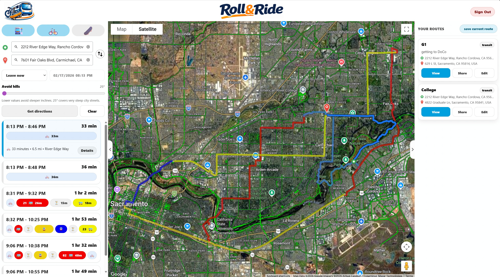

# Roll & Ride



### Description
**Roll & Ride** is a directions app optimized for bringing your bike or skateboard on public transit — using a multimodal route algorithm that combines public transit with bike/skate legs. The core idea is simple: get Google-quality routing, but tuned for riders who care about mode switches, last‑mile practicality, and shareable route links.

---

## 🚀 Getting started

### Deployed app
- **Front end:** https://roll-and-ride.netlify.app/

### Planning materials
- **Planning docs / wireframes:** https://trello.com/b/nKObu0ed/public-transit-bike-app

### Back-end repository
- **API repo:** https://github.com/wolnoid/roll-and-ride-back-end

---

## ✅ Capabilities
- **5 routing modes:** transit, bike, skate, transit + bike, transit + skate.
- **Transit time controls:** *Leave now*, *Depart at*, or *Arrive by*.
- **Detours / via points:** add/adjust route via points (e.g., to avoid a sketchy block or force a specific trail).
- **Alternate routes:** pick a different route option and see it update on the map.
- **Shareable URLs:** the route state is serialized into the URL (origin, destination, mode, via points, time).
- **Accounts + saved directions:** sign up/sign in with JWT auth, then **save routes** as bookmarks (rename, describe, edit mode, delete, and copy/share links).

---

## 🧭 How to use the app
1. Open the app and pick an **origin** and **destination**.
2. Choose a mode (**Transit / Bike / Skate**) or a combo (**Transit + Bike/Skate**).
3. (Optional) Set a **departure/arrival time**.
4. Click **Get directions**.
5. (Optional) Add **detours** (via points) to shape the route.
6. (Optional) **Sign in** to save the route and share it later.

---

## 💻 Run locally

### Front end (this repo)
1. Fork and clone this repository.
2. Install dependencies:
   ```bash
   npm i
   ```
3. Create a `.env` file in the project root:
   ```bash
   VITE_GOOGLE_MAPS_KEY=your_google_maps_key
   VITE_BACK_END_SERVER_URL=http://localhost:5000
   ```
4. Start the dev server:
   ```bash
   npm run dev
   ```

### Back end (separate repo)
Follow the setup instructions in the back-end README:
https://github.com/wolnoid/roll-and-ride-back-end

---

## 🧩 Technologies used
- **JavaScript**
- **React** (Vite)
- **React Router**
- **Google Maps Platform**
  - Maps JS API
  - Directions API
  - Places / Autocomplete (Place Picker)
  - (Optional/advanced) Elevation API for grade-aware skate timing

---

## 📌 Attributions
- **Google Maps Platform** (Maps, Directions, Places) — API key required.
- **@googlemaps/extended-component-library** — Google’s web components used for map + place picker UI.

---

## ⏭️ Next steps
- **Avoid-hills routing** as a true routing constraint (not just UI state).
- **More realistic skateboard ETAs** (grade/surface-aware models).
- **Rider-focused safety/preferences** (bike lanes, trails, lighting, high-traffic avoidance).
- **Saved directions enhancements:** folders/tags, pinned favorites, richer share previews.
- **Mobile-first UI polish** for small screens.
